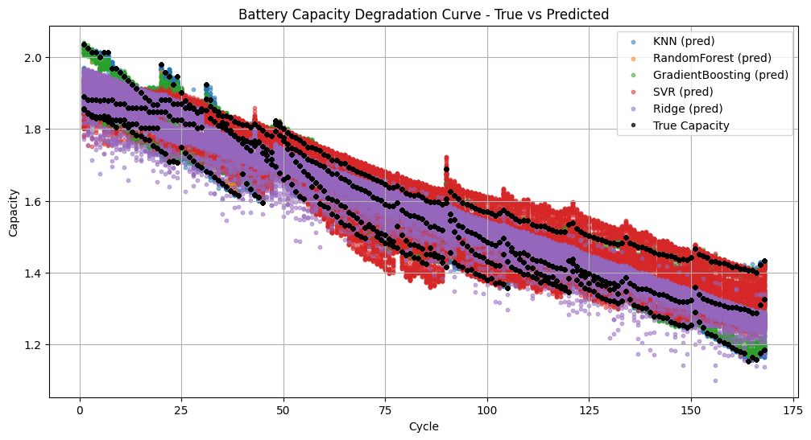
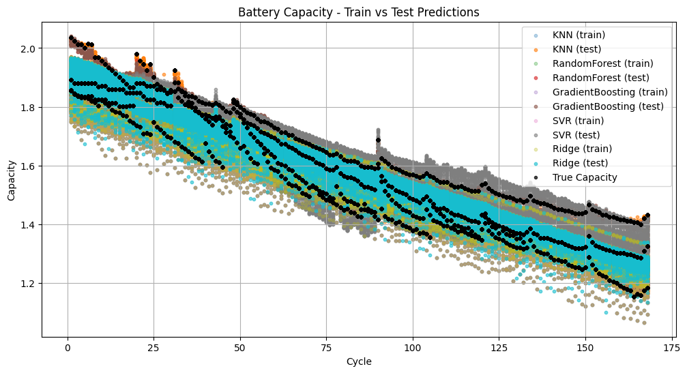

# ML_Battery_DDM — Battery Capacity Prediction & Degradation Modeling

[]()
[]()
[]()

## 📌 Project Overview

**ML_Battery_DDM** builds machine learning models to predict **battery capacity degradation** over charge/discharge cycles.  
The project compares classical ML algorithms (KNN, Random Forest, Gradient Boosting, SVR, Ridge Regression) to model **State of Health (SoH)** and **capacity fade trends**.

Key Contributions:
- Implemented and evaluated 5 ML algorithms on battery cycle data  
- Visualized training/test predictions against true capacity  
- Generated smooth degradation curves for model comparison  
- Highlighted predictive strengths and weaknesses across models  

---

## 📊 Results Summary

- All models capture the overall **capacity fade** trend with varying accuracy.  
- **Tree-based models** (RandomForest, GradientBoosting) show robust tracking of degradation.  
- **SVR & Ridge Regression** tend to underpredict in later cycles.  
- **KNN** provides reasonable short-term predictions but diverges in long-term trends.  

---

## 📈 Visualizations

### 1. Train vs Test Predictions
  
*Comparison of training and testing predictions across models (KNN, RF, GB, SVR, Ridge) vs true capacity.*

---

### 2. True vs Predicted Degradation
  
*Model-predicted degradation curves against the true battery capacity degradation trend.*

---

### 3. Smoothed Model Comparison
  
*Smoothed capacity degradation curves show that RandomForest and GradientBoosting track the trend most closely.*

---

## ⚙️ Modeling Pipeline

1. **Data Preprocessing**
   - Cleaned raw battery cycle data
   - Extracted features (voltage, current, temperature, cycle index, capacity)  
   - Normalized features for fair model comparison  

2. **Model Training**
   - Models used:  
     - KNN  
     - RandomForestRegressor  
     - GradientBoostingRegressor  
     - SVR  
     - Ridge Regression  

3. **Evaluation**
   - Metrics: MAE, RMSE, R²  
   - Visualization of predicted vs actual capacity curves  

---

## 🚀 Quickstart

```bash
# Clone repository
git clone https://github.com/ANUSHKA-creator-web/ML_Battery_DDM.git
cd ML_Battery_DDM

# Install dependencies
pip install -r requirements.txt

# Run notebook
jupyter lab
# open Battery_ML.ipynb
