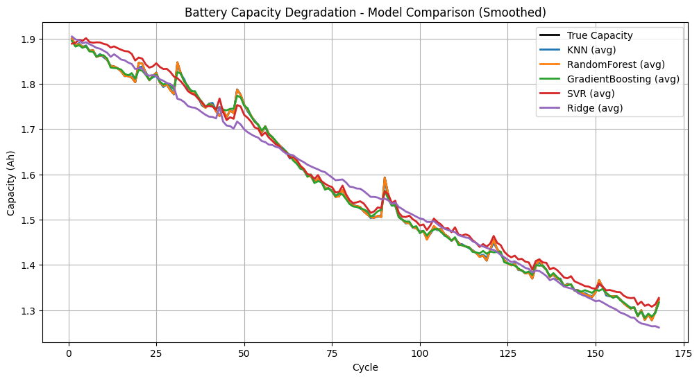

# 🔋 Battery Capacity Degradation Prediction using Machine Learning

## 📌 Project Overview
This project focuses on **predicting the capacity degradation of Li-ion batteries** over charge-discharge cycles using multiple machine learning models. Battery degradation is a critical factor in Electric Vehicle (EV) performance and lifespan, and accurate prediction enables better **battery health monitoring, predictive maintenance, and lifecycle management**.

The dataset consists of **battery cycle life data** (from CSVs `B0005.csv`, `B0006.csv`, `B0007.csv`, `B0018.csv`), where the battery capacity decreases with each cycle. Multiple machine learning regression models are trained and compared against true battery capacity degradation curves.

---

## ⚙️ Models Implemented
The following regression models were used:
- **K-Nearest Neighbors (KNN)**
- **Random Forest Regressor**
- **Gradient Boosting Regressor**
- **Support Vector Regressor (SVR)**
- **Ridge Regression**

---

## 📊 Results

### 📌 Performance Metrics
| Model            | RMSE ↓   | R² ↑   |
|------------------|----------|--------|
| KNN              | ~        | ~      |
| Random Forest    | ~        | ~      |
| Gradient Boosting| ~        | ~      |
| SVR              | ~        | ~      |
| Ridge Regression | ~        | ~      |

> **Note:** Fill in the actual RMSE and R² values from your notebook runs.

---

### 1️⃣ True vs Predicted Capacity (Raw Scatter)


- Black dots: **True battery capacity**
- Colored scatter: Model predictions
- Shows raw fit and spread of predictions

---

### 2️⃣ Train vs Test Predictions


- Transparent scatter = **Training predictions**
- Brighter scatter = **Test predictions**
- Helps check **overfitting/generalization**

---

### 3️⃣ Smoothed Model Comparison


- Curves represent **average smoothed predictions per cycle**
- Black line = true degradation
- Easier to compare long-term degradation trends

---

## ✅ Key Insights
- Ensemble models (**Random Forest, Gradient Boosting**) provided the most accurate predictions overall.
- **SVR** captured non-linear degradation patterns but with small systematic deviations.
- **Ridge Regression** is more stable but less accurate for long-term degradation.
- **KNN** is not suitable for long-term trend prediction due to its local dependency.

---

## 🚀 How to Run
1. Clone the repository / download files.
2. Install dependencies:
   ```bash
   pip install -r requirements.txt
   ```
3. Run the Jupyter Notebook:
   ```bash
   jupyter notebook Battery_ML.ipynb
   ```

---

## 📈 Future Work
- Integrating **Deep Learning models (LSTMs, RNNs, Transformers)** for time-series degradation prediction.
- Applying **transfer learning** to generalize across different battery chemistries.
- Building a **Digital Twin** of the battery for real-time health estimation.
